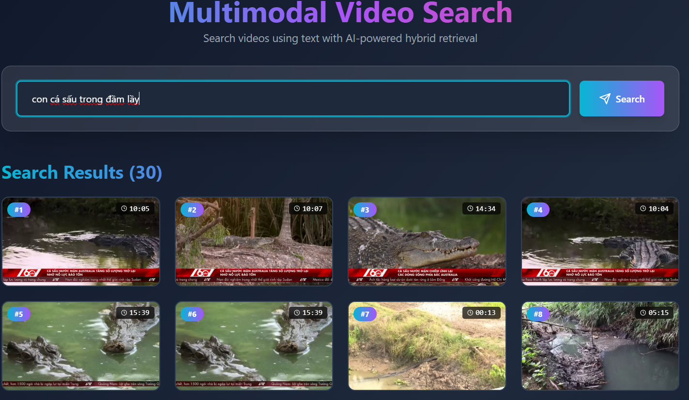

# 🎯 Cross-Modal Video Retrieval System



An enterprise-grade, AI-powered video keyframe architecture designed to retrieve specific moments from massive video datasets using natural language queries. It leverages state-of-the-art vision-language models and a two-stage hybrid search pipeline to achieve both ultra-low latency and high-precision relevance.

## 🔥 Core AI Capabilities

*   **Cross-Modal Embeddings:** Utilizes **OpenAI CLIP** to map visual data (keyframes, extracted objects) and textual queries into a shared high-dimensional semantic space. 
*   **Multilayered Hybrid Search:** Merges multiple embedding streams (`kf_embedding`, `ocr_embedding`, `obj_embedding`) using a dynamically `WeightedRanker` to maximize recall across diverse visual and textual contexts.
*   **Two-Stage Retrieval Structure (RAG):** Implements a coarse-grained ANN search via Milvus, followed by a fine-grained, cross-encoder reranking phase using **BAAI FlagReranker (BGE)** for state-of-the-art precision.
*   **Multilingual Query Understanding:** Integrates automated language translation (Vietnamese to English) for normalized embedding projection.
*   **GPU-Accelerated Inference:** Engineered with PyTorch `inference_mode`, CUDA optimizations, and robust exception handling to sustain high-throughput tensor operations.

## 🛠️ Technology Stack

### Deep Learning & NLP Models
*   **Vision-Language Model:** `open_clip_torch` (ViT/CLIP)
*   **Cross-Encoder Reranker:** HuggingFace `FlagEmbedding`
*   **Tensor Framework:** PyTorch (CUDA Backend)

### Vector Search Infrastructure
*   **Vector Database:** **Milvus** (Optimized for billion-scale ANN and Hybrid queries)
*   **Hybrid Scoring:** `pymilvus` WeightedRanker

### Application & Deployment
*   **API Framework:** FastAPI, Uvicorn
*   **Frontend:** React, Vite, TailwindCSS
*   **Deployment:** Docker Compose

## 📂 System Architecture Overview

```text
video_search_project/
├── backend/            # FastAPI core, Neural Network Inference, Milvus API integration
│   ├── app/models/     # Centralized Model Manager (CLIP, OCR, Reranker loading & caching)
│   ├── app/services/   # Multi-vector Hybrid Search orchestration & Translators
│   └── scripts/        # Ingestion scripts for deep learning artifacts
├── frontend/           # React + Vite Interactive UI
└── docker-compose.yml  # Milvus Vector DB & Object Storage cluster setup
```

## ⚙️ How to Run Locally

### Prerequisites
*   **NVIDIA GPU** with properly configured CUDA Toolkit (highly recommended for Inference and Milvus).
*   **Docker & Docker Compose**
*   **Python 3.10+** & **Node.js**

### 1. Vector Database Cluster
Launch the Milvus Vector Database along with its dependencies (MinIO, Etcd):
```bash
docker-compose up -d milvus-standalone etcd minio attu
```
*(GUI access to Attu is available at `http://localhost:8000` to inspect vector spaces).*

### 2. Neural Backend Engine
Navigate to `backend`, setup local environment, and start inference API:
```bash
cd backend
python -m venv .venv
# Activate:
# source .venv/bin/activate  (Linux/Mac)
# .venv\Scripts\activate     (Windows)

pip install -r requirements.txt
uvicorn app.main:app --host 0.0.0.0 --port 8080 --reload
```

### 3. Frontend Client
In a separate terminal:
```bash
cd frontend
npm install
npm run dev
```
Client runs at `http://localhost:3000`.

## 📈 Search Strategy Deep Dive
1. **Query Normalization:** Natural language input is translated/normalized.
2. **Dense Retrieval (Phase 1):** The query is sequentially projected into multiple representation spaces (`kf`, `ocr`, `obj`) via CLIP to retrieve a large set of coarse candidates utilizing Approximate Nearest Neighbor (ANN) across the Milvus collections.
3. **Cross-Encoder Scoring (Phase 2):** BAAI FlagReranker evaluates pairs of `(Query, Candidate Context)` simultaneously, computing explicit attention across the multimodal contextual representations to dynamically reorder the Top-K candidates for maximum hit-relevance.

## 📝 License
Distributed under the MIT License.
